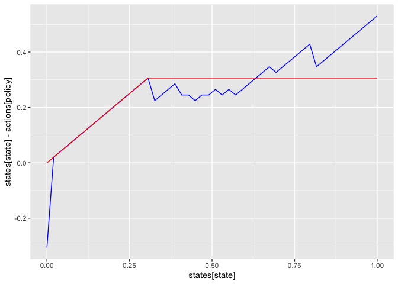
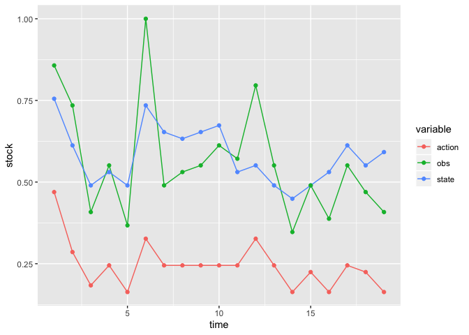
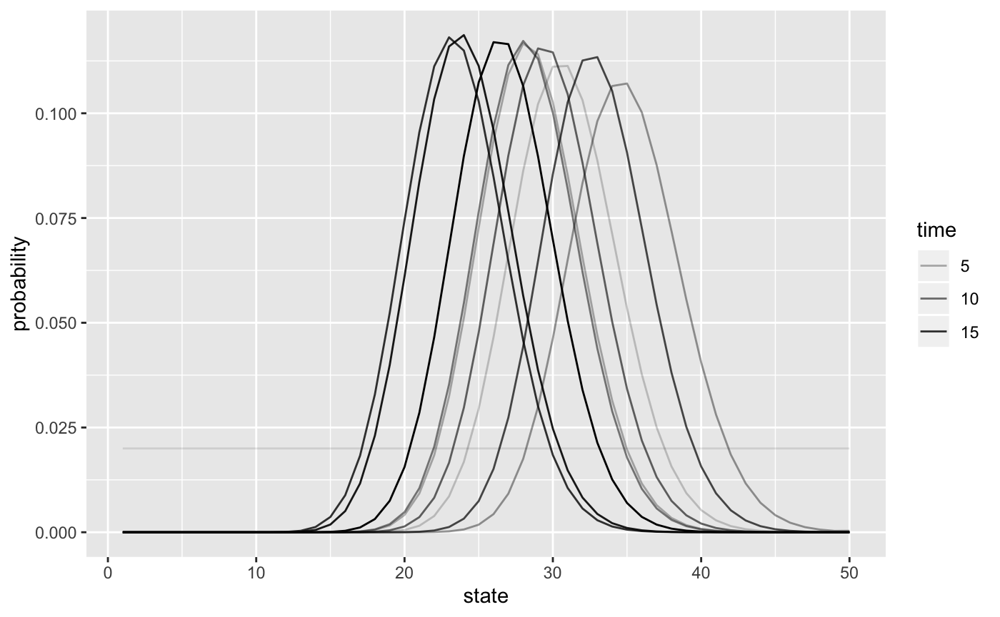

<!-- badges: start -->

[](https://github.com/boettiger-lab/sarsop/actions)
[](https://travis-ci.org/boettiger-lab/sarsop)
[](https://ci.appveyor.com/project/cboettig/sarsop)
[](https://codecov.io/github/boettiger-lab/sarsop?branch=master)
[](http://www.repostatus.org/#active)
[](https://cran.r-project.org/package=sarsop)
[](https://zenodo.org/badge/latestdoi/56890962)
<!-- badges: end -->

<!-- README.md is generated from README.Rmd. Please edit that file -->

# SARSOP for R

``` r
library(sarsop)
library(tidyverse) # for plotting
```

## Problem definition

Our problem is defined by a state space, `states`, representing the true
fish stock size (in arbitrary units), and an action space, `actions`
representing the number of fish that will be harvested (or attempted to
harvest). For simplicity, we will permit any action from 0 harvest to
the maximum possible state size.

A stock recruitment function, `f` describes the expected future state
given the current state. The true future state will be a stochastic draw
with this mean.

A reward function determines the value of taking action of harvesting
`h` fish when stock size is `x` fish; for simplicity this example
assumes a fixed price per unit harvest, with no cost on harvesting
effort. Future rewards are discounted.

``` r
states <- seq(0,1, length=50)
actions <- states
observations <- states
sigma_g <- 0.1
sigma_m <- 0.2
reward_fn <- function(x,h) pmin(x,h) # - .001*h
discount <- 0.95

r <- 1
K <- 0.75
f <- function(x, h){ # ricker
  s <- pmax(x - h, 0)
  s * exp(r * (1 - s / K) )
}
```

## Semi-analytic solution to Deterministic problem

For comparison, we note that an exact solution to the deterministic or
low-noise problem comes from Reed 1979, which proves that a constant
escapement policy \(S^*\) is optimal, with
\(\tfrac{df}{dx}|_{x = S^*} = 1/\gamma\) for discount \(\gamma\),

``` r
S_star <- optimize(function(x) -f(x,0) + x / discount, 
                   c(min(states),max(states)))$minimum
det_policy <- sapply(states, function(x) if(x < S_star) 0 else x - S_star)
det_action <- sapply(det_policy, function(x) which.min(abs(actions - x)))
```

When the state is observed without error, the problem is a Markov
Decision Process (MDP) and can be solved by stochastic dynamic
programming (e.g. policy iteration) over the discrete state and action
space. To do so, we need matrix representations of the above transition
function and reward function.

`sarsop` provides a convenience function for generating transition,
observation, and reward matrices given these parameters for the
fisheries management problem:

``` r
m <- fisheries_matrices(states, actions, observations, reward_fn, 
                        f, sigma_g, sigma_m, noise = "lognormal")
```

## POMDP Solution

In the POMDP problem, the true state is unknown, but measured
imperfectly. We introduce an observation matrix to indicate the
probability of observing a particular state \(y\) given a true state
\(x\). In principle this could depend on the action taken as well,
though for simplicity we assume only a log-normal measurement error
independent of the action chosen.

Long-running code to actually compute the solution.

``` r
log_dir <- "inst/extdata/vignette" 
alpha <- sarsop(m$transition, m$observation, m$reward, discount, 
                log_dir = log_dir,
                precision = .1, timeout = 200) # run much longer for more precise curve
```

`sarsop` logs solution files in the specified directory, along with a
metadata table. The metadata table makes it convenient to store multiple
solutions in a single directory, and load the desired solution later
using it’s id or matching metatata. We can read this solution from the
log where it is stored.

Given the model matrices and `alpha` vectors. Start belief with a
uniform prior over states, compute & plot policy:

``` r
state_prior = rep(1, length(states)) / length(states) # initial belief
df <- compute_policy(alpha, m$transition, m$observation, m$reward,  state_prior)

## append deterministic action
df$det <- det_action
```

``` r
ggplot(df, aes(states[state], states[state] - actions[policy])) + 
  geom_line(col='blue') + 
  geom_line(aes(y = states[state] - actions[det]), col='red')
```



Simulate management under the POMDP policy:

``` r
set.seed(12345)
x0 <- which.min(abs(states - K))
Tmax <- 20
sim <- sim_pomdp(m$transition, m$observation, m$reward, discount, 
                 state_prior, x0 = x0, Tmax = Tmax, alpha = alpha)
```

Plot simulation data:

``` r
sim$df %>%
  select(-value) %>%
  mutate(state = states[state], action = actions[action], obs = observations[obs]) %>%
  gather(variable, stock, -time) %>%
  ggplot(aes(time, stock, color = variable)) + geom_line()  + geom_point()
```



Plot belief evolution:

``` r
sim$state_posterior %>% 
  data.frame(time = 1:Tmax) %>%
  filter(time %in% seq(1,Tmax, by = 2)) %>%
  gather(state, probability, -time, factor_key =TRUE) %>% 
  mutate(state = as.numeric(state)) %>% 
  ggplot(aes(state, probability, group = time, alpha = time)) + geom_line()
```



-----

# Developer Notes

Unfortunately the appl source code is a bit dated and not suitable for
using as a shared library. It builds with lot of warnings and on Windows
it only builds with MS Visual Studio. This package tries to make things
as easy as possible for the user by bundling the appl executables and
wrap them with `system` calls in R. This package also provides
higher-level functions for POMDP analysis.

## Thanks

The underlying algorithm, SARSOP: Successive Approximations of the
Reachable Space under Optimal Policies was designed and described by
Hanna Kurniawati, David Hsu, and Wee Sun Lee, in Department of Computer
Science, National University of Singapore in 2008, see
<doi:10.15607/RSS.2008.IV.009>. Kurniawati et al acknowledge Yanzhu Du
and Xan Huang for helping with the software implementation in C++, which
at the time of that publication, was available at
`http://motion.comp.nus.edu.sg/projects/pomdp/pomdp.html`. That
implementation has since moved (in 2017, after this R package wrapper
was first implemented in 2016) to the GitHub repository:
<https://github.com/AdaCompNUS/sarsop>. The C++ implementation, “APPL”
acknowledges contributions based on an early version of ZMDP by Trey
Smith (`http://www.cs.cmu.edu/~trey/zmdp/`). ZMDP in turn uses code from
pomdp-solve by Tony Cassandra
(`http://www.cassandra.org/pomdp/code/index.shtml)`. The POMDPX parser
uses TinyXML by Lee Thomason (`http://www.grinninglizard.com/tinyxml/`).
Part of APPL makes use of code based on an early version of ZMDP
released under Apache License 2.0. The POMDPX parser makes use of
TinyXML released under zlib License. The rest of APPL is released under
GNU General Public License V2.

Jeroen Ooms developed the original R package compilation setup, Mykel
Kochenderfer and Markus Herrmann have been helpful in providing windows
builds using MS Visual Studio. Milad Memarzadeh wrote the R POMDPX
parsers and contributed to pacakge development. Carl Boettiger developed
and maintains the R package. The C++ library here is modified from the
original only to conform to modern C++ development standards and avoid
compilation errors or warnings under `gcc-8` and `gcc-9`, as well as
modern `clang` compilers.
