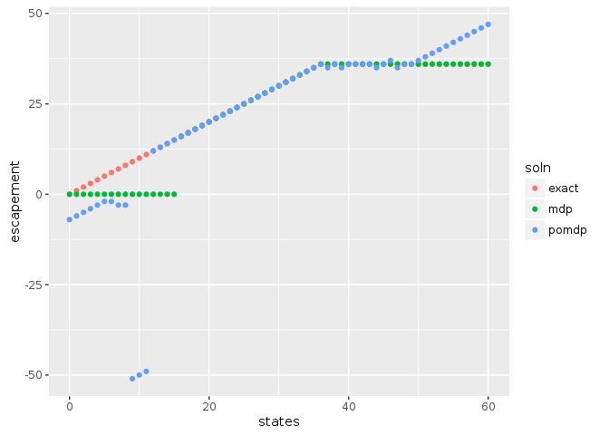
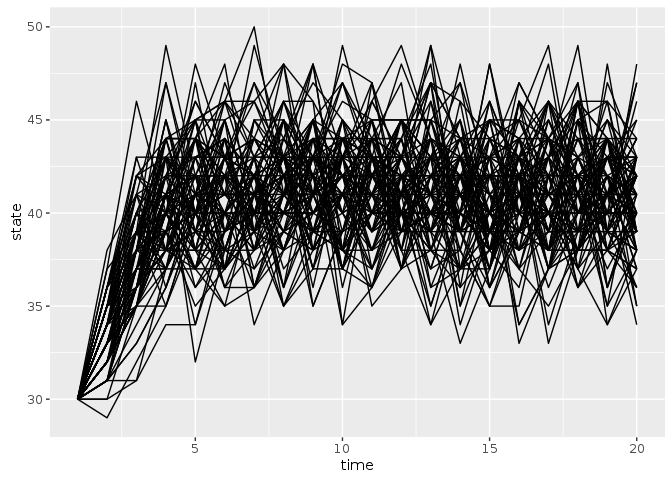

Here we consider the Partially Observed Markov Decision Process


First, we will load the libraries needed for this example.  The MDPtoolbox provides simple routines for solving 


```r
library("MDPtoolbox")
```

```
## Loading required package: Matrix
```

```
## Loading required package: linprog
```

```
## Loading required package: lpSolve
```

```r
library("appl")
library("tidyr")
```

```
## 
## Attaching package: 'tidyr'
```

```
## The following object is masked from 'package:Matrix':
## 
##     expand
```

```r
library("ggplot2")
library("purrr")
knitr::opts_chunk$set(cache = TRUE)
```


## Problem definition

Our problem is defined by a state space, `states`, representing the true fish stock size (in arbitrary units), 
and an action space, `actions` representing the number of fish that will be harvested (or attempted to harvest).  
For simplicitly, we will permit any action from 0 harvest to the maximum possible state size.  

A stock recruitment function, `f` describes the expected future state given the current state.  The true future
state will be a stochastic draw with this mean.

A reward function determines the value of taking action of harvesting `h` fish when stock size is `x` fish;
for simplicity this example assumes a fixed price per unit harvest, with no cost on harvesting effort. 
Future rewards are discounted.


```r
states <- 0:60
actions <- states
obs <- states

f <- function(x, h, r = 1, K = 50, C = 15){
  s <- pmax(x - h, 0)
  s * exp(r * (1 - s / K) * (s - C) / K)
}

sigma_g <- 0.05  # sqrt(log(1 + 0.1 / 6)) # Scale the log-standard-deviation to result in similar variance to a uniform distribution of width 0.1
sigma_m <- sigma_g

reward_fn <- function(x,h) pmin(x,h)
discount <- 0.99
```


## Exact / semi-analytic solution

For comparison, we note that an exact solution to the deterministic or low-noise problem comes from Reed 1979, which proves that a constant escapement
policy $S^*$ is optimal, with $\tfrac{df}{dx}|_{x = S^*} = 1/\gamma$ for discount $\gamma$,


```r
fun <- function(x) -f(x,0) + x / discount
out <- optimize(f = fun, interval = c(min(states),max(states)))
S_star <- round(out$minimum)
exact_policy <- sapply(states, function(x) if(x < S_star) 0 else x - S_star)
```

# Generate Matrices


```r
matrices <- fisheries_matrices(states, actions, obs, reward_fn, f, sigma_g, sigma_m)
```

## Numerical SDP Solution


```r
mdp <- MDPtoolbox::mdp_policy_iteration(matrices$transition, matrices$reward, discount)
```

```
## Note: method with signature 'Matrix#matrix' chosen for function '-',
##  target signature 'ddiMatrix#matrix'.
##  "ddiMatrix#ANY" would also be valid
```

```
## Note: method with signature 'ddiMatrix#dMatrix' chosen for function '-',
##  target signature 'ddiMatrix#dtCMatrix'.
##  "diagonalMatrix#triangularMatrix" would also be valid
```


```r
system.time( soln <- appl::pomdp_solve(matrices$transition, matrices$observation, matrices$reward, discount, 
                                 precision = 1, memory = 15750) )
```

```
## load time: 0.78 sec, init time: 19.1 sec, run time: 906.14 sec, final precision: 2.25639 end_condition:
```

```
##     user   system  elapsed 
## 1022.653    1.792 1024.706
```


```r
policies <- data.frame(states = states,
                       exact = states - exact_policy,
                       mdp = states - actions[mdp$policy],
                       pomdp = states - actions[soln$policy])


tidyr::gather(policies, soln, escapement, -states) %>%
  ggplot2::ggplot(ggplot2::aes(states, escapement, col = soln)) + ggplot2::geom_point()
```

<!-- -->


```r
sim_df <- purrr::map_df(1:100, 
                        function(n) 
                          data.frame(sim = n, 
                                     sim_pomdp(matrices$transition, matrices$observation, matrices$reward, 
                                               discount, policy = soln$policy, 
                                               x0 = round(length(states)/2), Tmax=20)))
```


```r
ggplot(sim_df, aes(time, state, group = sim)) + geom_line()
```

<!-- -->
