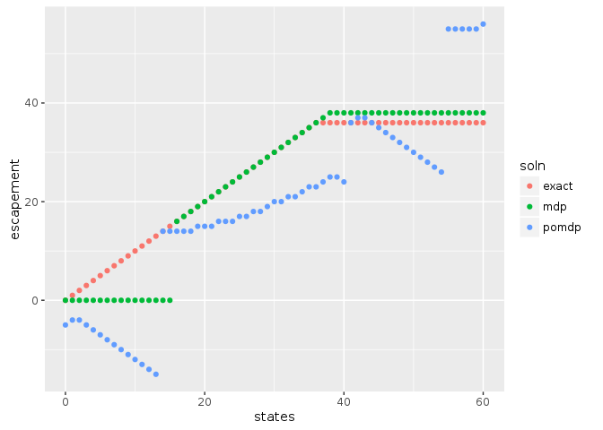

Here we consider the Partially Observed Markov Decision Process


First, we will load the libraries needed for this example.  The MDPtoolbox provides simple routines for solving 


```r
library("MDPtoolbox")
```

```
## Loading required package: Matrix
```

```
## Loading required package: linprog
```

```
## Loading required package: lpSolve
```

```r
library("appl")
knitr::opts_chunk$set(cache = TRUE)
```


## Problem definition

Our problem is defined by a state space, `states`, representing the true fish stock size (in arbitrary units), 
and an action space, `actions` representing the number of fish that will be harvested (or attempted to harvest).  
For simplicitly, we will permit any action from 0 harvest to the maximum possible state size.  

A stock recruitment function, `f` describes the expected future state given the current state.  The true future
state will be a stochastic draw with this mean.

A reward function determines the value of taking action of harvesting `h` fish when stock size is `x` fish;
for simplicity this example assumes a fixed price per unit harvest, with no cost on harvesting effort. 
Future rewards are discounted.


```r
states <- 0:60
actions <- states

f <- function(x, h, r = 1, K = 50, C = 20){
  s <- pmax(x - h, 0)
  s * exp(r * (1 - s / K) * (s - C) / K)
}

sigma_g <- sqrt(log(1 + 0.5 / 6)) # Scale the log-standard-deviation to result in similar variance to a uniform distribution of width 0.5

reward_fn <- function(x,h) pmin(x,h)
discount <- 0.95
```

## Exact / semi-analytic solution

For comparison, we note that an exact solution to the deterministic or low-noise problem comes from Reed 1979, which proves that a constant escapement
policy $S^*$ is optimal, with $\tfrac{df}{dx}|_{x = S^*} = 1/\gamma$ for discount $\gamma$,


```r
fun <- function(x) -f(x,0) + x / discount
out <- optimize(f = fun, interval = c(min(states),max(states)))
S_star <- round(out$minimum)
exact_policy <- sapply(states, function(x) if(x < S_star) 0 else x - S_star)
```

# Generate Matrices

When the state is observed without error, the problem is a Markov Decision Process (MDP) and can be solved by 
stochastic dynamic programming (e.g. policy iteration) over the discrete state and action space. To do so, we need
matrix representations of the above transition function and reward function:


```r
n_s <- length(states)
n_a <- length(actions)
transition <- array(0, dim = c(n_s, n_s, n_a))
reward <- array(0, dim = c(n_s, n_a))

for (k in 1:n_s) {
  for (i in 1:n_a) {
    nextpop <- f(states[k], actions[i])
    if(nextpop <= 0)
      transition[k, , i] <- c(1, rep(0, n_s - 1))
    else if(sigma_g > 0){
      x <- dlnorm(states, log(nextpop), sdlog = sigma_g)    # transition probability densities
      N <- plnorm(states[n_s], log(nextpop), sigma_g)       # CDF accounts for prob density beyond boundary
      x <- x * N / sum(x)                                   # normalize densities to  = cdf(boundary)
      x[n_s] <- 1 - N + x[n_s]                              # pile remaining probability on boundary
      transition[k, , i] <- x                             # store as row of transition matrix
    } else {
     stop("sigma_g not > 0")
    }
    reward[k, i] <- reward_fn(states[k], actions[i])
  }
}
```

## Numerical SDP Solution


```r
mdp <- MDPtoolbox::mdp_policy_iteration(transition, reward, discount)
```

```
## Note: method with signature 'Matrix#matrix' chosen for function '-',
##  target signature 'ddiMatrix#matrix'.
##  "ddiMatrix#ANY" would also be valid
```

```
## Note: method with signature 'ddiMatrix#dMatrix' chosen for function '-',
##  target signature 'ddiMatrix#dtCMatrix'.
##  "diagonalMatrix#triangularMatrix" would also be valid
```


## POMDP problem

In the POMDP problem, the true state is unknown, but measured imperfectly.  We introduce
an observation matrix to indicate the probabilty of observing a particular state $y$ given
a true state $x$. In principle this could depend on the action taken as well, though for 
simplicity we assume only a log-normal measurement error independent of the action chosen.


```r
sigma_m <- sigma_g
observed_states <- states
n_z <- length(observed_states)

observation <- array(0, dim = c(n_s, n_z, n_a))
for (k in 1:n_a) {
  if(sigma_m <= 0){
    observation[, , k] <- diag(n_s)
  } else {
    for (i in 1:n_s) {
      if(states[i] <= 0){ ## cannot do dlnorm with mu = log(0) = -Inf.  Cannot solve if belief has already converged
        x <- dlnorm(observed_states, -1, sigma_m)
        observation[i, , k] <- x / sum(x)
      } else {
        x <- dlnorm(observed_states, log(states[i]), sdlog = sigma_m)    # transition probability densities
        ## Normalize using CDF
        N <- plnorm(observed_states[n_s], log(states[i]), sigma_m)       # CDF accounts for prob density beyond boundary
        x <- x * N / sum(x)                                   # normalize densities to  = cdf(boundary)
        x[n_s] <- 1 - N + x[n_s]                              # pile remaining probability on boundary
        observation[i, , k] <- x                             # store as row of transition matrix
      }
    }
  }
}
```


With the transition matrix, observation matrix, reward matrix, and discount factor in hand, we have now fully specified the POMDP problem and are ready to solve.

Note that unlike the MDP algorithm used above, this solution is approximate, and some care must be taken to ensure the solution has converged appropriately.  Here
we set a desired precision limit, but also set a memory limit which will halt the algroithm early rather than permit any node to exceed this memory allocation.


```r
system.time( soln <- appl::pomdp(transition, observation, reward, discount, mc.cores = 2, precision = 2, memory = 7750) )
```

```
##      user    system   elapsed 
## 44019.517    27.839 45345.896
```

```r
soln
```

```
## $value
##  [1]  0.000000  0.547619  2.302326  3.366279  4.500000  5.611765  6.742690
##  [8]  7.857988  8.946108 10.076923 11.205882 12.358824 13.443787 14.511765
## [15] 15.758824 17.083734 18.857974 20.816388 22.709040 24.595604 26.422216
## [22] 28.326774 30.037913 31.620536 33.344912 34.752592 36.360723 37.556282
## [29] 39.029479 39.978012 41.000821 42.238001 43.178184 44.072966 44.672233
## [36] 45.651601 46.466959 47.359046 48.187817 48.715639 49.541973 50.004081
## [43] 50.778018 51.649475 52.196957 52.706733 53.383852 53.728479 54.473656
## [50] 54.684259 55.284537 55.668092 56.025920 56.644932 57.056078 57.344682
## [57] 57.921576 58.126308 58.699537 58.974245 60.941918
## 
## $policy
##  [1]  0  6  6  7  9 11 13 15 17 19 21 23 25 27 29  0  0  0  0  0  0  0  0
## [24]  0  0  0  0  0  0  0  0  0  0  0  1  2  3  4  5  5  6  7  7  8  9  9
## [47] 10 10 11 11 11 12 12 13 13 13 14 14 14 15 17
## 
## $diagnostics
##       load_time_sec init_time_sec run_time_sec final_precision
##  [1,] 0.93          14.62         14.62        0              
##  [2,] 0.93          14.66         14.66        0              
##  [3,] 0.84          13.66         13.66        0              
##  [4,] 0.84          13.73         13.73        0              
##  [5,] 0.98          15.15         15.15        0              
##  [6,] 0.95          14.99         14.99        0              
##  [7,] 0.83          14.41         14.41        0              
##  [8,] 0.93          14.64         14.64        0              
##  [9,] 0.83          14.59         14.6         0              
## [10,] 0.96          14.61         14.61        0              
## [11,] 0.99          15.34         15.34        0              
## [12,] 1             15.36         15.36        0              
## [13,] 0.99          15.24         15.31        0.503083       
## [14,] 1             15.55         15.62        1.31248        
## [15,] 0.98          15.42         28.4         1.76164        
## [16,] 1             15.47         32.98        1.87528        
## [17,] 0.99          15.41         45.86        1.9566         
## [18,] 0.96          15.41         70.45        1.96356        
## [19,] 0.98          15.48         126.6        1.9925         
## [20,] 1             15.53         171.51       1.99736        
## [21,] 0.99          15.4          217.31       1.98837        
## [22,] 0.98          15.78         340.23       1.98853        
## [23,] 0.97          15.49         447.72       1.9893         
## [24,] 0.98          15.37         486.43       1.99094        
## [25,] 0.98          15.44         497.4        1.98881        
## [26,] 0.98          15.49         650.85       1.99855        
## [27,] 1             15.48         805.08       1.9984         
## [28,] 0.94          15.27         1321.7       1.99005        
## [29,] 0.97          15.5          1540.39      1.99842        
## [30,] 0.96          14.55         1972.58      1.99549        
## [31,] 0.99          15.6          2226.58      1.99441        
## [32,] 1             15.57         1901.57      1.99684        
## [33,] 0.93          15.17         2202.33      1.995          
## [34,] 0.96          15.36         2313.6       1.99693        
## [35,] 0.95          14.06         2416.07      2.01777        
## [36,] 0.94          15.05         2671.03      2.0275         
## [37,] 0.99          15.49         2553.13      1.99289        
## [38,] 0.96          15.12         2663.3       2.00743        
## [39,] 0.98          15.42         2652.02      1.99709        
## [40,] 0.97          15.5          2729.65      1.99461        
## [41,] 0.96          14.56         2791.07      2.00438        
## [42,] 0.97          15.41         2769.89      2.03902        
## [43,] 0.98          15.67         2682.67      2.00789        
## [44,] 0.98          15.44         2361.7       1.99149        
## [45,] 1.04          15.71         2479.66      2.01113        
## [46,] 1.19          15.15         2484.62      1.99967        
## [47,] 0.95          15.06         2583.49      2.04119        
## [48,] 0.95          15.31         2676.54      1.99477        
## [49,] 0.97          15.62         2655.55      2.03609        
## [50,] 0.98          14.92         2126.66      1.99994        
## [51,] 1             15.46         2364.06      2.00693        
## [52,] 1             15.46         2586.88      1.977          
## [53,] 1.04          15.28         1927.78      1.99772        
## [54,] 0.96          15.31         2352.63      1.99068        
## [55,] 0.94          14.11         1873.49      1.99831        
## [56,] 0.99          15.6          2394.51      1.99484        
## [57,] 0.93          14.74         3052.91      2.01415        
## [58,] 0.97          15.16         2776.03      2.01455        
## [59,] 0.99          14.97         2757.26      2.06921        
## [60,] 1.13          15.56         2599.82      2.0903         
##       end_condition               
##  [1,] "  target precision reached"
##  [2,] "  target precision reached"
##  [3,] "  target precision reached"
##  [4,] "  target precision reached"
##  [5,] "  target precision reached"
##  [6,] "  target precision reached"
##  [7,] "  target precision reached"
##  [8,] "  target precision reached"
##  [9,] "  target precision reached"
## [10,] "  target precision reached"
## [11,] "  target precision reached"
## [12,] "  target precision reached"
## [13,] "  target precision reached"
## [14,] "  target precision reached"
## [15,] "  target precision reached"
## [16,] "  target precision reached"
## [17,] "  target precision reached"
## [18,] "  target precision reached"
## [19,] "  target precision reached"
## [20,] "  target precision reached"
## [21,] "  target precision reached"
## [22,] "  target precision reached"
## [23,] "  target precision reached"
## [24,] "  target precision reached"
## [25,] "  target precision reached"
## [26,] "  target precision reached"
## [27,] "  target precision reached"
## [28,] "  target precision reached"
## [29,] "  target precision reached"
## [30,] "  target precision reached"
## [31,] "  target precision reached"
## [32,] "  target precision reached"
## [33,] "  target precision reached"
## [34,] "  target precision reached"
## [35,] Character,0                 
## [36,] Character,0                 
## [37,] "  target precision reached"
## [38,] Character,0                 
## [39,] "  target precision reached"
## [40,] "  target precision reached"
## [41,] Character,0                 
## [42,] Character,0                 
## [43,] Character,0                 
## [44,] "  target precision reached"
## [45,] Character,0                 
## [46,] "  target precision reached"
## [47,] Character,0                 
## [48,] "  target precision reached"
## [49,] Character,0                 
## [50,] "  target precision reached"
## [51,] Character,0                 
## [52,] "  target precision reached"
## [53,] "  target precision reached"
## [54,] "  target precision reached"
## [55,] "  target precision reached"
## [56,] "  target precision reached"
## [57,] Character,0                 
## [58,] Character,0                 
## [59,] Character,0                 
## [60,] Character,0
```


```r
policies <- data.frame(states = states,
                       exact = states - exact_policy,
                       mdp = states - actions[mdp$policy],
                       pomdp = states - soln$policy)

library("tidyr")
```

```
## 
## Attaching package: 'tidyr'
```

```
## The following object is masked from 'package:Matrix':
## 
##     expand
```

```r
library("ggplot2")
tidyr::gather(policies, soln, escapement, -states) %>%
  ggplot2::ggplot(ggplot2::aes(states, escapement, col = soln)) + ggplot2::geom_point()
```

<!-- -->

