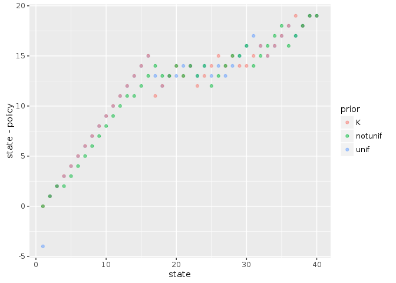
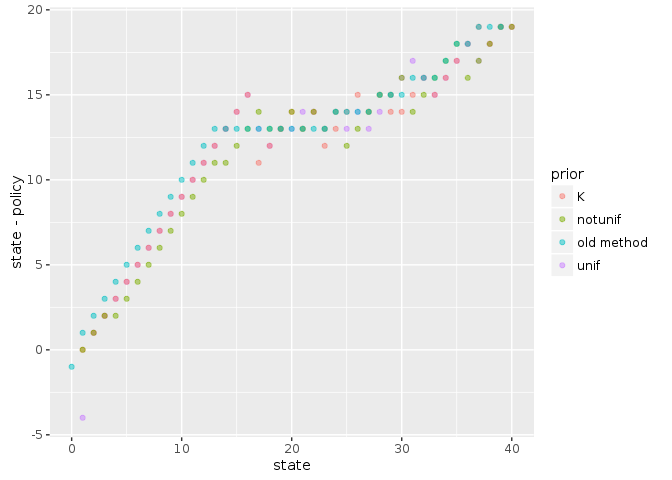

```r
library("MDPtoolbox")
```

```
## Loading required package: Matrix
```

```
## Loading required package: linprog
```

```
## Loading required package: lpSolve
```

```r
library("appl")
library("tidyr")
```

```
## 
## Attaching package: 'tidyr'
```

```
## The following object is masked from 'package:Matrix':
## 
##     expand
```

```r
library("ggplot2")
library("purrr")
knitr::opts_chunk$set(cache = TRUE)
```


Typical model setup:


```r
n_s <- 40
precision <- 5

states <- 0:(n_s-1)
actions <- states
obs <- states

f <- function(x, h, r = 1, K = 35){
  s <- pmax(x - h, 0)
  s * exp(r * (1 - s / K) )
}

sigma_g <- 0.2  
sigma_m <- sigma_g

reward_fn <- function(x,h) pmin(x,h)
discount <- 0.95

m <- fisheries_matrices(states, actions, obs, reward_fn, f, sigma_g, sigma_m) 
```


SARSOP computes only from attainable states, thus if the initial belief excludes most states, the calculation is much faster.
Here we compare the alpha vectors calculated from an initial belief reflecting an observation 


```r
system.time(unif <- pomdp_solve(m$transition, m$observation, m$reward, discount, rep(1, n_s) / n_s, precision = precision))
```

```
## load time: 0.28 sec, init time: 2.65 sec, run time: 45.31 sec, final precision: 4.98029 end_condition:   target precision reached
```

```
##    user  system elapsed 
##  63.243   0.230  63.511
```


```r
belief <- m$observation[,n_s-4,1]
system.time(K <- pomdp_solve(m$transition, m$observation, m$reward, discount, belief, precision = precision))
```

```
## load time: 0.3 sec, init time: 2.72 sec, run time: 47.62 sec, final precision: 4.96461 end_condition:   target precision reached
```

```
##    user  system elapsed 
##  64.614   0.202  64.841
```


```r
system.time(notunif <- pomdp_solve(m$transition, m$observation, m$reward, discount, 1:n_s / sum(1:n_s), precision = precision))
```

```
## load time: 0.27 sec, init time: 2.74 sec, run time: 54.59 sec, final precision: 4.97651 end_condition:   target precision reached
```

```
##    user  system elapsed 
##  71.452   0.210  71.728
```


```r
p <- rbind(data.frame(prior = "unif", unif), 
           data.frame(prior = "K", K), 
           data.frame(prior = "notunif", notunif))

ggplot(p, aes(state, state - policy, col=prior)) + 
  geom_point(alpha = 0.5)
```

<!-- -->


Compare to old pomdp solution:


```r
system.time(soln <- pomdp(m$transition, m$observation, m$reward, discount, precision = precision))
```

```
##     user   system  elapsed 
## 2707.088    8.881 2718.700
```


```r
old_method <- data.frame(prior = "old method", policy = soln$policy, value = soln$value, state = states)

rbind(p, old_method) %>%
  ggplot(aes(state, state - policy, col=prior)) + 
  geom_point(alpha = 0.5)
```

<!-- -->

