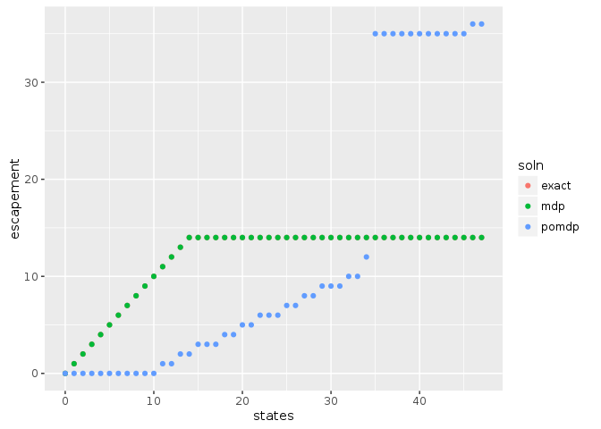

Here we consider the Partially Observed Markov Decision Process


First, we will load the libraries needed for this example.  The MDPtoolbox provides simple routines for solving 


```r
library("MDPtoolbox")
library("appl")
library("printr")
knitr::opts_chunk$set(cache = TRUE)
```


## Problem definition

Our problem is defined by a state space, `states`, representing the true fish stock size (in arbitrary units), 
and an action space, `actions` representing the number of fish that will be harvested (or attempted to harvest).  
For simplicitly, we will permit any action from 0 harvest to the maximum possible state size.  

A stock recruitment function, `f` describes the expected future state given the current state.  The true future
state will be a stochastic draw with this mean.

A reward function determines the value of taking action of harvesting `h` fish when stock size is `x` fish;
for simplicity this example assumes a fixed price per unit harvest, with no cost on harvesting effort. 
Future rewards are discounted.


```r
states <- 0:47
actions <- states

f <- function(x, h, r = 1, K = 33){
  s <- pmax(x - h, 0)
  s * exp(r * (1 - s / K) )
}

sigma_g <- sqrt(log(1 + 0.5 / 6)) # Scale the log-standard-deviation to result in similar variance to a uniform distribution of width 0.5

reward_fn <- function(x,h) pmin(x,h)
discount <- 0.95
```

## Exact / semi-analytic solution

For comparison, we note that an exact solution to the deterministic or low-noise problem comes from Reed 1979, which proves that a constant escapement
policy $S^*$ is optimal, with $\tfrac{df}{dx}|_{x = S^*} = 1/\gamma$ for discount $\gamma$,


```r
fun <- function(x) -f(x,0) + x / discount
out <- optimize(f = fun, interval = c(min(states),max(states)))
S_star <- round(out$minimum)
exact_policy <- sapply(states, function(x) if(x < S_star) 0 else x - S_star)
```

# Generate Matrices

When the state is observed without error, the problem is a Markov Decision Process (MDP) and can be solved by 
stochastic dynamic programming (e.g. policy iteration) over the discrete state and action space. To do so, we need
matrix representations of the above transition function and reward function:


```r
n_s <- length(states)
n_a <- length(actions)
transition <- array(0, dim = c(n_s, n_s, n_a))
reward <- array(0, dim = c(n_s, n_a))

for (k in 1:n_s) {
  for (i in 1:n_a) {
    nextpop <- f(states[k], actions[i])
    if(nextpop <= 0)
      transition[k, , i] <- c(1, rep(0, n_s - 1))
    else if(sigma_g > 0){
      x <- dlnorm(states, log(nextpop), sdlog = sigma_g)    # transition probability densities
      N <- plnorm(states[n_s], log(nextpop), sigma_g)       # CDF accounts for prob density beyond boundary
      x <- x * N / sum(x)                                   # normalize densities to  = cdf(boundary)
      x[n_s] <- 1 - N + x[n_s]                              # pile remaining probability on boundary
      transition[k, , i] <- x                             # store as row of transition matrix
    } else {
     stop("sigma_g not > 0")
    }
    reward[k, i] <- reward_fn(states[k], actions[i])
  }
}
```

## Numerical SDP Solution


```r
mdp <- MDPtoolbox::mdp_policy_iteration(transition, reward, discount)
```

```
## Note: method with signature 'Matrix#matrix' chosen for function '-',
##  target signature 'ddiMatrix#matrix'.
##  "ddiMatrix#ANY" would also be valid
```

```
## Note: method with signature 'ddiMatrix#dMatrix' chosen for function '-',
##  target signature 'ddiMatrix#dtCMatrix'.
##  "diagonalMatrix#triangularMatrix" would also be valid
```


## POMDP problem

In the POMDP problem, the true state is unknown, but measured imperfectly.  We introduce
an observation matrix to indicate the probabilty of observing a particular state $y$ given
a true state $x$. In principle this could depend on the action taken as well, though for 
simplicity we assume only a log-normal measurement error independent of the action chosen.


```r
sigma_m <- sigma_g
observed_states <- states
n_z <- length(observed_states)

observation <- array(0, dim = c(n_s, n_z, n_a))
for (k in 1:n_a) {
  if(sigma_m <= 0){
    observation[, , k] <- diag(n_s)
  } else {
    for (i in 1:n_s) {
      if(states[i] <= 0){ ## cannot do dlnorm with mu = log(0) = -Inf.  Cannot solve if belief has already converged
        x <- dlnorm(observed_states, -1, sigma_m)
        observation[i, , k] <- x / sum(x)
      } else {
        x <- dlnorm(observed_states, log(states[i]), sdlog = sigma_m)    # transition probability densities
        ## Normalize using CDF
        N <- plnorm(observed_states[n_s], log(states[i]), sigma_m)       # CDF accounts for prob density beyond boundary
        x <- x * N / sum(x)                                   # normalize densities to  = cdf(boundary)
        x[n_s] <- 1 - N + x[n_s]                              # pile remaining probability on boundary
        observation[i, , k] <- x                             # store as row of transition matrix
      }
    }
  }
}
```


With the transition matrix, observation matrix, reward matrix, and discount factor in hand, we have now fully specified the POMDP problem and are ready to solve.

Note that unlike the MDP algorithm used above, this solution is approximate, and some care must be taken to ensure the solution has converged appropriately.  Here
we set a desired precision limit, but also set a memory limit which will halt the algroithm early rather than permit any node to exceed this memory allocation.


```r
system.time( soln <- pomdp(transition, observation, reward, discount, mc.cores = 2, precision = 2, memory = 7750) )
```

```
##       user     system    elapsed 
## 166769.234    144.826  65790.842
```


```r
soln
```

```
## $value
##  [1]   0.00000  87.05453 177.01211 180.59037 183.50246 185.82946 187.79368
##  [8] 189.54839 191.00818 192.39897 193.66186 194.77580 195.78898 196.70918
## [15] 197.76498 198.70744 199.75232 200.78792 201.63306 202.64907 203.44896
## [22] 204.50892 205.34194 206.33598 207.12030 208.02628 208.59519 209.64195
## [29] 210.28304 211.11557 211.84454 212.38494 213.22188 213.71538 214.43465
## [36] 214.74678 215.46778 216.28492 216.50277 217.18442 217.53029 218.09974
## [43] 218.35028 218.94820 219.34811 219.54769 220.16668 220.98368
## 
## $policy
##  [1]  0  0  0  0  0  0  0  0  0  0  0  0  0  1  2  3  4  5  6  7  8  9 10
## [24] 11 11 12 12 13 13 14 15 15 16 16 17 17 18 19 19 20 20 21 21 22 23 23
## [47] 24 23
## 
## $diagnostics
##       load_time_sec init_time_sec run_time_sec final_precision
##  [1,] 0.41          11.18         2749.61      2.44073        
##  [2,] 0.4           11.62         3132.14      4.96565        
##  [3,] 0.49          10.44         2746.2       5.10978        
##  [4,] 0.46          10.8          2758.25      5.21883        
##  [5,] 0.48          10.53         2639.28      5.30857        
##  [6,] 0.48          10.5          2924.08      5.2872         
##  [7,] 0.48          10.47         2440.59      5.32303        
##  [8,] 0.48          10.63         2538.39      5.25637        
##  [9,] 0.48          10.64         2744.72      5.14852        
## [10,] 0.47          10.78         2874.65      5.03229        
## [11,] 0.5           10.43         2470.18      4.84829        
## [12,] 0.48          10.5          3079.87      5.06602        
## [13,] 0.49          10.57         2910.54      4.93261        
## [14,] 0.51          10.83         2766.4       4.942          
## [15,] 0.46          10.53         2708.86      4.87543        
## [16,] 0.49          10.56         2487.65      4.84764        
## [17,] 0.48          10.39         2908.25      4.83848        
## [18,] 0.48          10.92         2901.51      4.83696        
## [19,] 0.48          10.46         2596.27      4.82243        
## [20,] 0.48          10.59         2567.72      4.76561        
## [21,] 0.49          10.6          2962.18      4.83165        
## [22,] 0.49          10.92         2890.96      4.90314        
## [23,] 0.48          10.45         2614.23      4.78606        
## [24,] 0.48          10.63         2602.31      4.77379        
## [25,] 0.48          10.62         2854.15      4.82546        
## [26,] 0.47          10.69         2929.8       4.82411        
## [27,] 0.49          10.53         2673.69      4.77696        
## [28,] 0.49          10.52         2586.36      4.71901        
## [29,] 0.48          10.54         2859.41      4.7501         
## [30,] 0.48          10.7          2910.53      4.79828        
## [31,] 0.49          10.47         2558.06      4.7082         
## [32,] 0.48          10.45         2535.54      4.72326        
## [33,] 0.49          10.45         2788.73      4.62688        
## [34,] 0.49          10.65         2875.26      4.68189        
## [35,] 0.46          10.63         2653.2       4.67051        
## [36,] 0.54          10.66         2597.53      4.74356        
## [37,] 0.49          10.47         2835         4.82728        
## [38,] 0.48          10.59         2881.75      4.69191        
## [39,] 0.48          10.46         2583.84      4.75921        
## [40,] 0.48          10.47         2539.46      4.74443        
## [41,] 0.49          10.5          2829.37      4.80889        
## [42,] 0.46          10.56         2931.29      4.84439        
## [43,] 0.48          10.78         2615.14      4.83894        
## [44,] 0.48          10.53         2528.8       4.80807        
## [45,] 0.48          10.41         2816.82      4.82039        
## [46,] 0.48          10.92         2887.69      4.91401        
## [47,] 0.48          10.64         2486.7       4.87122        
##       end_condition
##  [1,] Character,0  
##  [2,] Character,0  
##  [3,] Character,0  
##  [4,] Character,0  
##  [5,] Character,0  
##  [6,] Character,0  
##  [7,] Character,0  
##  [8,] Character,0  
##  [9,] Character,0  
## [10,] Character,0  
## [11,] Character,0  
## [12,] Character,0  
## [13,] Character,0  
## [14,] Character,0  
## [15,] Character,0  
## [16,] Character,0  
## [17,] Character,0  
## [18,] Character,0  
## [19,] Character,0  
## [20,] Character,0  
## [21,] Character,0  
## [22,] Character,0  
## [23,] Character,0  
## [24,] Character,0  
## [25,] Character,0  
## [26,] Character,0  
## [27,] Character,0  
## [28,] Character,0  
## [29,] Character,0  
## [30,] Character,0  
## [31,] Character,0  
## [32,] Character,0  
## [33,] Character,0  
## [34,] Character,0  
## [35,] Character,0  
## [36,] Character,0  
## [37,] Character,0  
## [38,] Character,0  
## [39,] Character,0  
## [40,] Character,0  
## [41,] Character,0  
## [42,] Character,0  
## [43,] Character,0  
## [44,] Character,0  
## [45,] Character,0  
## [46,] Character,0  
## [47,] Character,0
```


```r
policies <- data.frame(states = states,
                       exact = states - exact_policy,
                       mdp = states - actions[mdp$policy],
                       pomdp = states - soln$policy)

library("tidyr")
library("ggplot2")
tidyr::gather(policies, soln, escapement, -states) %>%
  ggplot2::ggplot(ggplot2::aes(states, escapement, col = soln)) + ggplot2::geom_point()
```

<!-- -->

