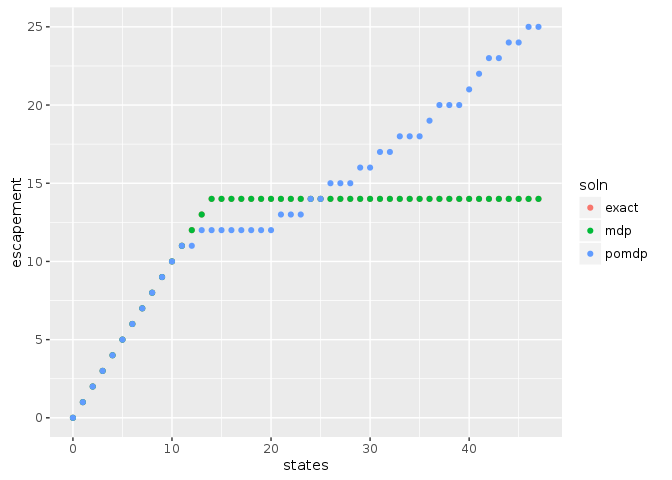

```r
library("MDPtoolbox")
```

```
## Loading required package: Matrix
```

```
## Loading required package: linprog
```

```
## Loading required package: lpSolve
```

```r
library("appl")
#knitr::opts_chunk$set(cache = TRUE)
```


## MDP Problem definition


```r
states <- 0:47
actions <- states
f <- function(x, h, r = 1, K = 33){
  s <- pmax(x - h, 0)
  s * exp(r * (1 - s / K) )
}

sigma_g = 0.5

# Scale for lognormal
sigma_g <- sqrt(log(1 + sigma_g / 6))
reward_fn <- function(x,h) pmin(x,h)
discount <- 0.95
```

## Exact / semi-analytic solution


```r
fun <- function(x) -f(x,0) + x / discount
out <- optimize(f = fun, interval = c(min(states),max(states)))
S_star <- round(out$minimum)
exact_policy <- sapply(states, function(x) if(x < S_star) 0 else x - S_star)
```

# Generate Matrices


```r
n_s <- length(states)
n_a <- length(actions)
transition <- array(0, dim = c(n_s, n_s, n_a))
reward <- array(0, dim = c(n_s, n_a))

for (k in 1:n_s) {
  for (i in 1:n_a) {
    nextpop <- f(states[k], actions[i])
    if(nextpop <= 0)
      transition[k, , i] <- c(1, rep(0, n_s - 1))
    else if(sigma_g > 0){
      x <- dlnorm(states, log(nextpop), sdlog = sigma_g)    # transition probability densities
      N <- plnorm(states[n_s], log(nextpop), sigma_g)       # CDF accounts for prob density beyond boundary
      x <- x * N / sum(x)                                   # normalize densities to  = cdf(boundary)
      x[n_s] <- 1 - N + x[n_s]                              # pile remaining probability on boundary
      transition[k, , i] <- x                             # store as row of transition matrix
    } else {
     stop("sigma_g not > 0")
    }
    reward[k, i] <- reward_fn(states[k], actions[i])
  }
}
```

## Numerical SDP Solution


```r
mdp <- MDPtoolbox::mdp_policy_iteration(transition, reward, discount)
```

```
## Note: method with signature 'Matrix#matrix' chosen for function '-',
##  target signature 'ddiMatrix#matrix'.
##  "ddiMatrix#ANY" would also be valid
```

```
## Note: method with signature 'ddiMatrix#dMatrix' chosen for function '-',
##  target signature 'ddiMatrix#dtCMatrix'.
##  "diagonalMatrix#triangularMatrix" would also be valid
```


## POMDP problem


```r
sigma_m <- sigma_g
observed_states <- states
n_z <- length(observed_states)

observation <- array(0, dim = c(n_s, n_z, n_a))
for (k in 1:n_a) {
  if(sigma_m <= 0){
    observation[, , k] <- diag(n_s)
  } else {
    for (i in 1:n_s) {
      if(states[i] <= 0){ ## cannot do dlnorm with mu = log(0) = -Inf.  Cannot solve if belief has already converged
        x <- dlnorm(observed_states, -1, sigma_m)
        observation[i, , k] <- x / sum(x)
      } else {
        x <- dlnorm(observed_states, log(states[i]), sdlog = sigma_m)    # transition probability densities
        ## Normalize using CDF
        N <- plnorm(observed_states[n_s], log(states[i]), sigma_m)       # CDF accounts for prob density beyond boundary
        x <- x * N / sum(x)                                   # normalize densities to  = cdf(boundary)
        x[n_s] <- 1 - N + x[n_s]                              # pile remaining probability on boundary
        observation[i, , k] <- x                             # store as row of transition matrix
      }
    }
  }
}
```


```r
## Note: parallel doesn't error intelligably and cannot be interrupted gracefully either. Debug by running:
#system.time(soln <- pomdp(transition, observation, reward, discount, stdout = TRUE))
system.time( soln <- pomdp(transition, observation, reward, discount, mc.cores = 8, precision = 10, memory = 2000) )
```

```
##      user    system   elapsed 
## 32361.562    37.690  5115.503
```


```r
policies <- data.frame(states = states,
                       exact = states - exact_policy,
                       mdp = states - actions[mdp$policy],
                       pomdp = states - soln$policy)

library("tidyr")
```

```
## 
## Attaching package: 'tidyr'
```

```
## The following object is masked from 'package:Matrix':
## 
##     expand
```

```r
library("ggplot2")
tidyr::gather(policies, soln, escapement, -states) %>%
  ggplot2::ggplot(ggplot2::aes(states, escapement, col = soln)) + ggplot2::geom_point()
```

<!-- -->

